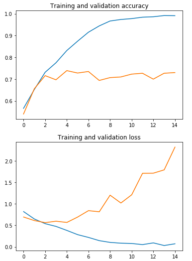
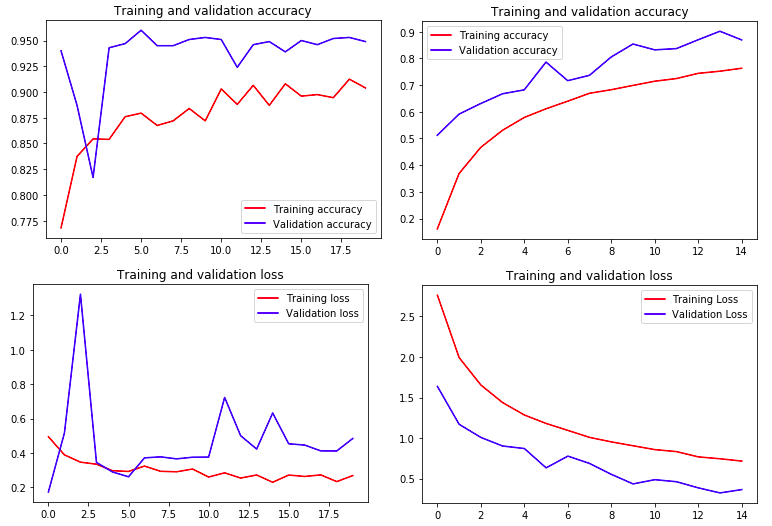

Deep Learning with TensorFlow - Computer Vision Problems - Tutorials
================
Codes courtesy from TensorFlow in Practice Specialization by deeplearning.ai on Coursera, modified by Tran Nguyen

-   [BASIC ABOUT DEEP LEARNING](#basic-about-deep-learning)
-   [MORE ON CONVOLUTIONAL NEURAL NETWORKS](#more-on-convolutional-neural-networks)
-   [IMAGE AUGMENTATION](#image-augmentation)
-   [MULTICLASS CLASSIFICATIONS](#multiclass-classifications)
-   [MODEL EVALUATION](#model-evaluation)

Quick notes from the courses + codes to run in Mac terminal. If you want to learn more about TensorFlow, check out the great courses in the "TensorFlow in Practice Specialization" by deeplearning.ai on Coursera.

The codes work well with TensorFlow 2.0

``` bash
pip install tensorflow==2.0.0-alpha0
```

BASIC ABOUT DEEP LEARNING
-------------------------

#### 1. Simple neural network

-   Codes: TF\_HelloWorld.py
-   What you will learn: (i) Creating a simple neural network using tensorflow to predict a simple y = ax + b function.

#### 2. Image classifier: Fashion dataset

-   Codes: TF\_fashion\_mnist.py, data is in the package keras.datasets.fashion\_mnist
-   What you will learn: (i) Creating a neural network to classify 10 different classes of fashion data (clothes, shoes, bags, etc.) (ii) Using callback to stop training when the accuracy reaches certain threshold. (iii) Using convolution for better training. (iv) Visualizing the effect of convolution on training.

#### 3. Basic ideas about Convolution

-   Codes: Convolutions\_basic.py
-   What you will learn: (i) Basic idea about convolution (a technique to extract features from an image). (ii) Display images using the matplotlib.pyplot package. (iii) Trying different filters for convolution.

#### 4. The neural network that recognizes handwriting digit

-   Codes: TF\_hand\_writing\_recognition.py, data is in the package keras.datasets.mnist
-   What you will learn: Practicing all the concepts in session (3) with the handwriting data.

#### 5. Image classifier: Horse versus human

-   Codes: TF\_Human\_horse.py, download the data as noted in the codes
-   An image classifier to distinguish human or horse image using Convolutional Neural Networks
-   What you will learn: (i) Two-class classification problem. (ii) Training with more complex data (images 300x300 with 3 bytes color) (iii) Using ImageDataGenerator to process the data

#### 6. Image classifier: Happy versus sad faces

-   Codes: TF\_HappyVsSad\_Face.py, download the data as noted in the codes
-   An image classifier to distinguish sad and happy icons with the accuracy greater than 99.9%
-   What you will learn: Practicing all the concepts in session (5) with the happy-or-sad face data.

#### 7. TF\_Saving\_Loading\_Model.py

-   Codes: TF\_Saving\_Loading\_Model.py
-   What you will learn: How to save and load the model using the h5py package

MORE ON CONVOLUTIONAL NEURAL NETWORKS
-------------------------------------

#### 8. Image classifier: Dogs versus Cats (Kaggle dataset)

-   Codes: TF\_Dogs\_Cats.py, download the data as noted in the codes
-   An image classifier to distinguish dog and cat
-   What you will learn: (i) Practicing again all the concepts above. (ii) Plotting the training/validation accuracy and loss to evaluate the model. (iii) Learning about overfitting based on the training/validation accuracy and loss plots.



#### 9. Visualizing Intermediate Representations

-   Codes: TF\_Dogs\_Cats\_Visualization.py, need to run the TF\_Dogs\_Cats.py file first to obtain the model.
-   What you will learn: See how input gets transformed when going through the convnet =&gt; investigating features that the convnet has learned.
-   Output interpretation: Each ouput is generated from a random image in the set. Each colum: an image of a specific filter. Each row is the output of a layer.


"As you can see we go from the raw pixels of the images to increasingly abstract and compact representations. The representations downstream start highlighting what the network pays attention to, and they show fewer and fewer features being "activated"; most are set to zero. This is called "sparsity." Representation sparsity is a key feature of deep learning.

These representations carry increasingly less information about the original pixels of the image, but increasingly refined information about the class of the image. You can think of a convnet (or a deep network in general) as an information distillation pipeline." (Note from the Course notebook <https://colab.sandbox.google.com/github/lmoroney/dlaicourse/blob/master/Course%202%20-%20Part%202%20-%20Lesson%202%20-%20Notebook.ipynb>)

#### 10. Data Processing:

-   Codes: TF\_DataProcessing\_for\_CNN\_DogCatDataset.py, download the data as noted in the codes
-   What you will learn: Randomly splitting the data into training and testing dataset =&gt; generate suitable input for ImageGenerator

IMAGE AUGMENTATION
------------------

#### 11. Image augmentation:

-   Codes: TF\_Human\_horse\_Augmentation.py, download the data as noted in the codes
-   What you will learn: For Image augmentation: everything will stay the same like in session 5, except the ImageDataGenerator process:

``` r
 # Augmentation on the training data only. 
 # Beside rescaling, the image augmentation is applied many modifications 
      train_datagen = ImageDataGenerator(
          rescale = 1/255,
          rotation_range = 40,
          width_shift_range = 0.2,
          height_shift_range = 0.2,
          shear_range = 0.2,
          zoom_range = 0.2,
          horizontal_flip = True,
          fill_mode = 'nearest')
```

#### 12. Transfer learning - Overcome overfitting using dropout:

-   Codes: TF\_Dogs\_Cats\_Transfer\_Learning.py
-   What you will learn: (i) Download an existing model and freeze its layers to not be retrained. (ii) add new DNN to retrain your own data.

1.  When adding DNN at the bottom of the network, you specify your output layer with the number of classes you want =&gt; change the number of classes the model can classify when using transfer learning (i.e. the original model handled 1000 classes, but yours handles just 2).
2.  regularization using dropouts: remove a random number of neurons in the neural network =&gt; preventing over-specialization and overfitting. Drop-out is mostly used in Computer Vision (since there are not enough features for training on image). The drawbacks: The cost function J is not well defined (not only go down in every epoch) =&gt; Using dropout loses the debugging tool. Therefore, in implementation: need to turn off dropout for debugging (to see if the cost function goes well), then turn on drop-out to see the effect. If dropout rate is set too high, the network would lose specialization to the effect that it would be inefficient or ineffective at learning, driving accuracy down.

MULTICLASS CLASSIFICATIONS
--------------------------

#### 13. Multiclass classification - Rock - paper - scissors:

-   Codes: TF\_RockPaperScissors.py, download the data as noted in the codes
-   What you will learn: (i) Changing from binary to multi class classifications:
    -   class\_mode='categorical' instead of 'binary'
    -   tf.keras.layers.Dense(3, activation='softmax') instead of tf.keras.layers.Dense(1,activation = 'sigmoid')
    -   loss = 'categorical\_crossentropy" instead of loss = 'binary\_crossentropy'

#### 14.Multiclass classification - Sign language:

-   Codes: TF\_sign\_language.py
-   What you will learn: (i) How to download data from kaggle. (ii) how to process data from .csv file.

MODEL EVALUATION
----------------

#### 15. Plotting loss and accuracy on the training - evaluation data:

-   Some plots of the loss and accuracy:




